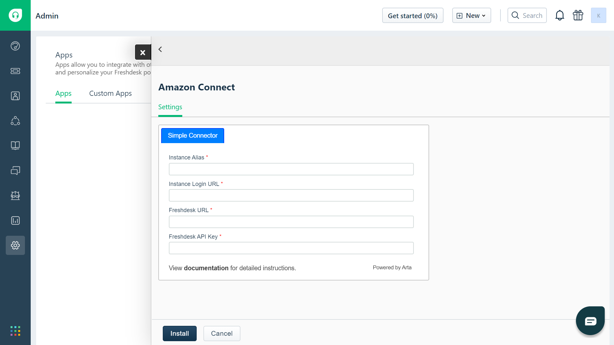
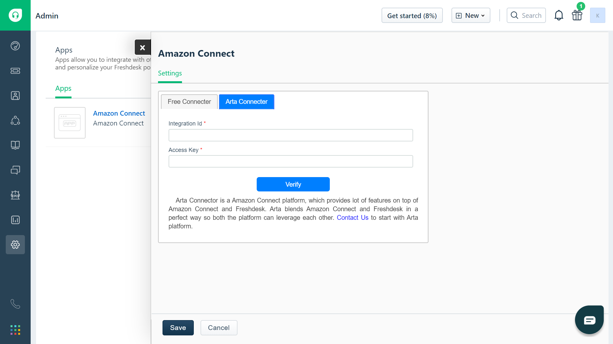

# Connector for Freshdesk

### Introduction

Arta Connector blends Amazon Connect and Freshdesk in a perfect way so both the platform can leverage each other.

### Features

- Call Logs
- Contacts with search
- Save contact
- Multilanguage 
- Caller Indetification through Freshdesk contacts
- Display Opentickets based on caller
- Create New ticket while in call
- Add note in existing ticket while in call
- Quick Connects

<!-- | Free Connector        | Paid Connector           |
| ------------- |:-------------:|
| Call Logs      | Call Logs |
| Contacts with search      | Contacts with search      |
| Save contact | Save contact      |
|  | Multilanguage     | -->

### Free Connector Installation



- **Instance Alias** - Enter Amazon Connect Instance Alias name

    ```text
    eg : sandeza
    ```

- **Instance Login URL** - Enter Amazon Connect Instance login URL. You can find that in Connect Instances overview page

    ```text
    eg : https://sandeza.awsapps.com/connect/login
    ```

- **Freshdesk URL** - Enter your domain URL of freshdesk where you are going to install the connector.  
    > **Important** : Include `https://` in beginning and don't include `/` at last as shown below

    ```text
    eg : https://sandeza-support.freshdesk.com
    ```

- **Freshdesk API Key** - Enter your Freshdesk API Key. 
    > **Important** : Respective user of API Key which was provided should have access to create ticket.


Once you filled all mandotery fields proceed to Install

<!-- ### Arta Connector Installation



- **Integration Id** - Enter Arta Freshdesk integration id. You find your Freshdesk integration id in arta platform under Freshdesk Integrations

- **Access Key** - Enter Arta Freshdesk access key. You find your Freshdesk access key in arta platform under Freshdesk Integrations -->