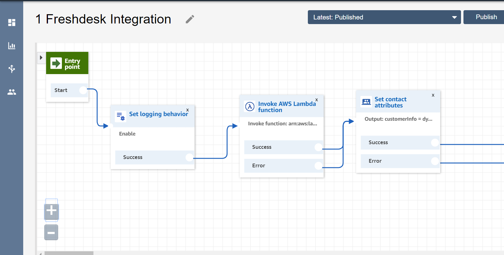

# Initial Setup

## Domain Whitelist

Open the AWS Connect instance setup page and go to `Application integration` tab then whitelist the following domains

> https://ccp.arta.sandeza.io \
> https://d3h0owdjgzys62.cloudfront.net \
> Your freshdesk URL **eg : https://sandeza-support.freshdesk.com**

## Lambda Setup

### Adding layers

Select `layers` on the sidemenu and click `Create Layer` button

Download the layer files from <a href="https://lambda-layers-1h8d3.s3.ap-south-1.amazonaws.com/freshdesk-integration-layer.zip" target="_blank">S3 link</a>

Fillout the fields as required and upload the ZIP file which downloaded before. Select `Node 12.x` as runtime and create the layer.

### Creating Lambda

Create new lambda function with basic execution permission with runtime `Node 12.x`  and copy the code from the <a href="https://github.com/Sandeza/arta-freshdesk-integration-lambda" target="_blank">Github repo</a>.

> Note : Lambda and AWS Connect instance should be in same region

Add layers to lambda by selecting `Layers` under `Designer` tab and click `Add a layer` button as shown below

Select the layer which you have created before and the layer version then click Add button

Now the layer was added to lambda as shown below

Add the environment variables as shown in below image

> Note : Include `https://` in beginning and don't include `/` at last

### Whitelist

Open the AWS Connect instance setup page and go to `Contact flows` tab then whitelist the created lambda

## Contact Flow setup

As Shown in the below image add lambda and set contact attribute block.

Open the lambda block and select the created lambda then change the Timeout to 8sec

Open the Set contact attribute block and give same Destination key and Attribute as `customerInfo` and type as `External`

>Note : Dont't change Destination key and Attribute value

