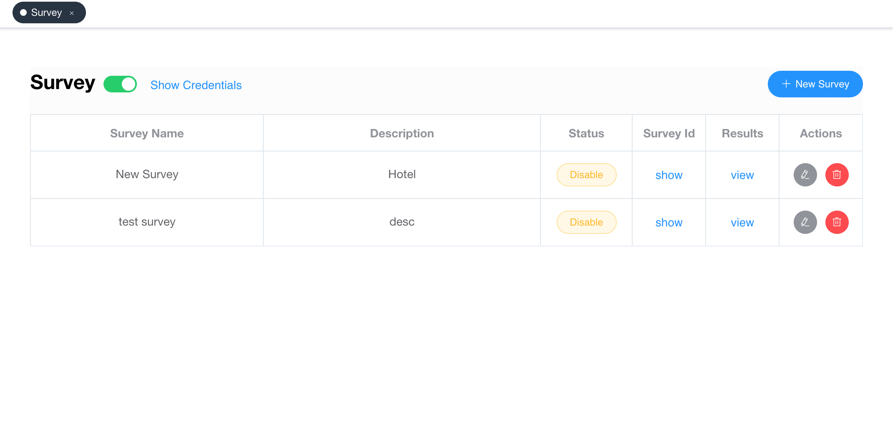
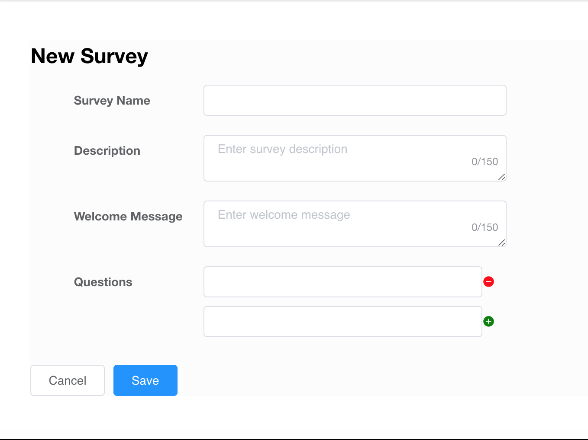
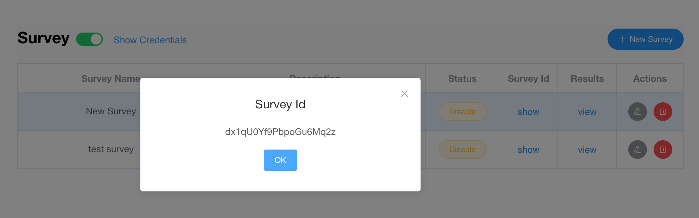
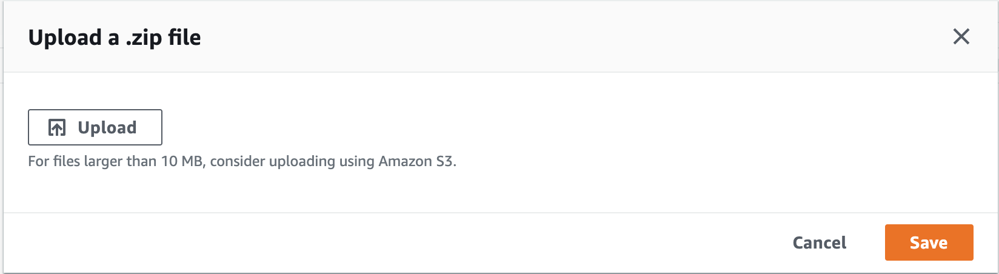
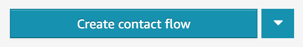
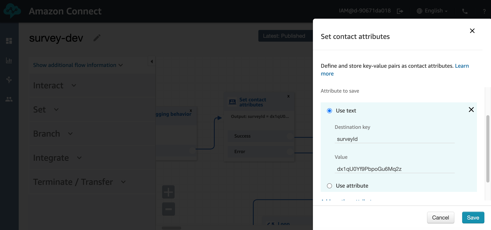
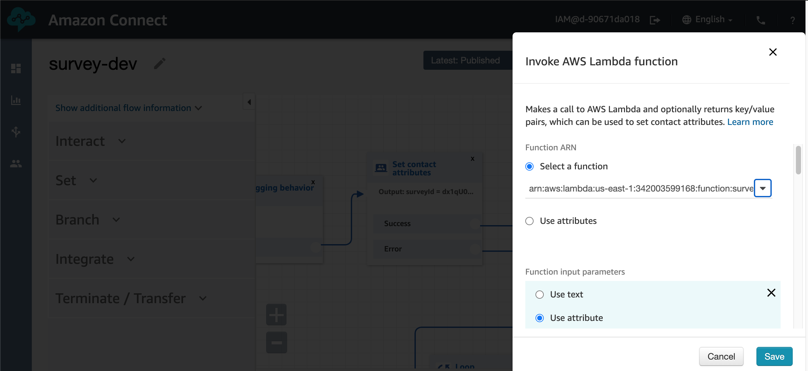
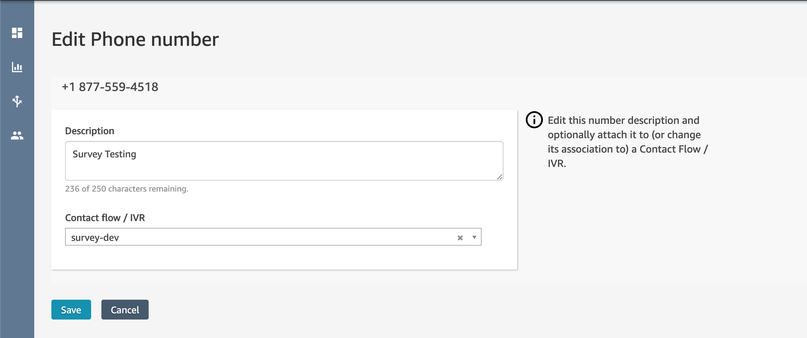
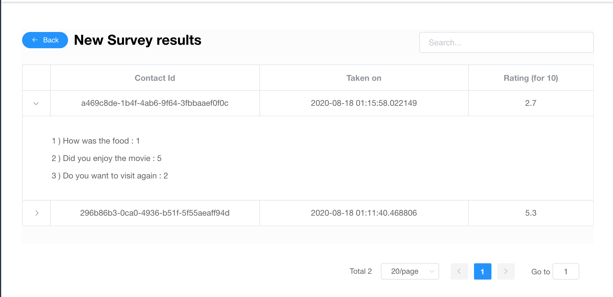

# Survey feature for Amazon connect

## Introduction

Arta Survey helps you to easily add survey feature to your Amazon Connect instance using the Arta platform.

## Features

- Plug and play survey feature
- No coding needed
- Easy to add surveys
- Create and manage multiple surveys
- Dashboard to view the survey results
- Enable/Disable surveys whenever you want 
- Single lambda for multiple surveys

<!-- | Free Connector        | Paid Connector           |
| ------------- |:-------------:|
| Call Logs      | Call Logs |
| Contacts with search      | Contacts with search      |
| Save contact | Save contact      |
|  | Multilanguage     | -->

## Setup

### Arta Platform Setup:

- **Step 1: Click Add Survey** 

- **Step 2: Add the new survey** - Enter all the survey questions

- **Step 3: Copy the Survey ID**- Make sure the survey is enabled and copy the survey ID

### AWS Setup:

- **Step 1: Create a new Lambda Function** 

Create a new Python Lambda function with neccesary permission to access Amazon Connect and with Python Version 3.8

- **Step 2: Import Lambda Package** 

In the Lambda under the actions select Upload a .zip file

Upload the provided deployment package 

- **Step 3: Adding the Lambda to your connect instance** 

Go to Amazon Connect and select your instance . Choose Contact Flows And select your Lambda function.

- **Step 4: Importing the Survey Contact Flow** 

In your connect instance create a new contact flow

On the right top corner select Import Flow and upload the contact flow

- **Step 5: Adding the survey ID**
In the contact flow open the Set Contact Attributes block

Jnder the surveyId paste the ID of the survey you want to use and hit save

- **Step 5: Select the Aws Lambda Function**

In the Invoke Aws Lambda function block select the lambda you created and hit save

Publish the contact flow

- **Step 6: Assign the contact flow to a Phone Number**

## Results

**Go to the arta dashboard and click on View Results**

